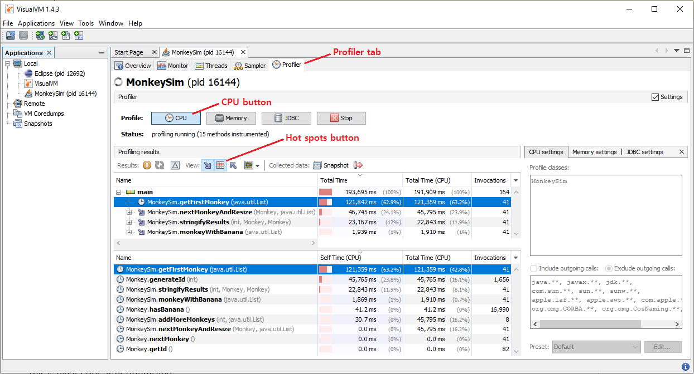
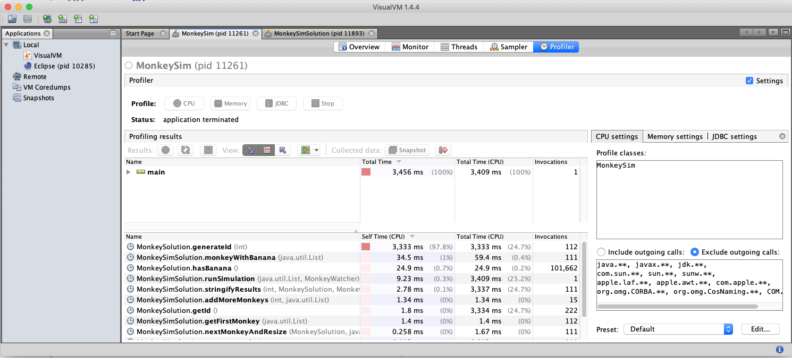

# Exercise 4 Performance Testing Exercise

For this exercise, you will test and improve the performance of a monkey
simulation software.  When you are asked to improve the performance of any
code, how would you go about it?  Maybe you will start eyeballing the code to
guess where the program is wasting a lot of its time and try to refactor the
code that way.  But what if your code base is millions of lines long?  Talk
about finding a needle in a haystack.  We will learn to use a technique called
profiling that takes all the guesswork out of the picture.

Profiling is a form of dynamic program analysis where data is collected
during runtime of a program, usually for the purposes of performance
optimization.  The data is typically collected through some form of
instrumentation on the program code, where extra instructions are inserted
specifically for the purposes of monitoring the program while it runs and
collecting data.  For Java, this instrumentation happens at the bytecode
level.  For example, if the profiler wanted to measure how long a method
takes to execute, it may do instrumentation similar to the following:

```
void foo() {
  ___instrumentMethodBegin("foo");
  // body of foo()
  ___instrumentMethodEnd("foo");
}

void ___instrumentMethodBegin(String method) {
  beginTime = ___getTime();
}

void ___instrumentMethodEnd(String method) {
  endTime = ___getTime();
  duration = endTime - beginTime;
  ___addToMethodRunningTime(method, duration);
}
```

But enough of profiling theory, how do I actually use it?  Performance
debugging through profiling is an iterative process.  On each iteration, you
will do the following:

1. Profile the program.  Sort all methods in descending order of running time and
   search for refactoring opportunities starting from the top.
1. Refactor selected method to be more performant (being careful not to change functionality using pinning tests).
1. Profile again to determine whether you made an improvement, otherwise go back to refactoring.

In this way, on each iteration, you will be able to focus on the method that
has the potential for improvement.  It is important to profile at the
beginning of each iteration since you are modifying the program on each
iteration.

The code is available under the src/ directory.

## MonkeySim Description

This code runs MonkeySim, which simulates a group of monkeys throwing a banana back around until it gets to the first monkey.  It accepts one argument, which states which monkey has the banana initially.

The game shall continue until the first monkey gets the banana, at which point the simulation shall end.

The monkey who has the banana shall throw it to another monkey during each round.

If a monkey is even-numbered (e.g., monkey #2, monkey #4, etc.), then the monkey with the banana shall throw the banana to the monkey equal to one-half of that initial monkey's number.  For example, monkey #4 shall throw the banana to monkey #2, and monkey #20 shall throw the banana to monkey #10.

If a monkey is odd-numbered (and not monkey #1), the monkey with the banana shall throw it to the monkey equal to three times the number of that monkey plus one `(3n + 1)`.  For example, monkey #5 shall throw the banana to monkey #16 `((3 * 5) + 1)`.

If Monkey #1 catches the banana, the system shall display the number of rounds it took for Monkey #1 to catch the banana and then the program shall exit.

At each round, the current status of who is doing the throwing and who is catching shall be displayed, along with the round number (which should start at 1).  It should use the following format: "Round 1: Threw banana from Monkey (#54 / ID 223546) to Monkey (#27 / ID 223519)"

Each monkey has an ID; this ID shall remain constant.  For instance, Monkey #5 shall always have ID 223497, and Monkey #160 shall always have ID 223652.  Any changes to the code should not modify the ID value.

Sample runs are shown in the sample_runs.txt file.

## How to Run MonkeySim

1. For Windows do (for running MonkeySim with argument 27):
    ```
    run.bat 27
    ```
1. For Mac / Linux do (for running MonkeySim with argument 27):
    ```
    bash run.sh 27
    ```

Alternatively, I've created an Eclipse project for you so you can use Eclipse to import the existing project and run it from there.

## What to do

In order to determine the "hot spots" of the application, you will need to run a profiler such as VisualVM (download at https://visualvm.github.io/).  Using the profiler, determine a method you can modify to measurably increase the speed of the application without modifying behavior.

Some tips for using VisualVM:
1. Your Java app will only show up in VisualVM _during_ execution.  When the MonkeySim application shows up on the left panel, you need to quickly double click on the MonkeySim application and then click on the Profiler tab.  Then, on the Profiler window that shows up on the main pane, quickly click on the CPU button to start profiling CPU utilization.  Finally, click on the "Hot spots" button to get a list of methods sorted by running times.

If you right click on one of the methods in the "Hot spots" methods list, you'll get a context menu.  If you click on a the "Find in Forward Calls" item, you can see the call tree that got you to that method.
1. If your app runs very quickly, you may not have time to perform the above actions before the app terminates!  In that case, you may want to insert a sleep() at the beginning of the main() method, during which you can perform these actions.  For example:
   ```
   try {
      Thread.sleep(10000);
   } catch (InterruptedException iex) {
   }
   ```

Now you are ready to modify that method.  Remember, the program should work
EXACTLY the same as before, except it should be faster and take up less CPU
time.  In order to guarantee this, you need pinning tests.  For the
exercise, you will use the runs in sample_runs.txt as a systems level
pinning tests.  Meaning, the output should match the original output exactly
in each case (except the execution time of course).  Feel free to automate
the pinning tests using a script like we learned at the beginning of chapter
12, automated systems testing.

Refactor *four* of the most time consuming methods in MonkeySim.  You should
not change the behavior of any of the methods; only refactor the implementation
so that they are more efficient.  Three of the methods will be very
straightforward because they contain obviously redundant computation.  The
remaining one (generateId) is less straightforward.  All the computation is
required to generate the ID.  Hint: but do we really need to generate all those
IDs?

This is what I got after optimizing:  
  
I gave argument 27 for the run.  Note that now the run takes approximately 3 seconds to run, which is a marked improvement over 37 minutes for the original code!  Now the most time consuming method is generateId by a wide margin.  But there is no way to refactor that method without changing the output.  Refactoring any other method would have negligible impact on performance.  So this is when you pat yourself on the back and declare victory.

## Submission

Each pairwise group will submit the exercise *once* to GradeScope, by *one member* of the group.  The submitting member will press the "View or edit group" link at the top-right corner of the assignment page after submission to add his/her partner.  That way, the feedback will be accessible to both of you.  I recommend that you divide the list of methods to implement / test into two halves and working on one half each.

You will do two submissions for this exercise.

1. You will create a github repository just for exercise 4.  Add your partner as a collaborator so both of you have access.  Make sure you keep the repository *PRIVATE* so that nobody else can access your repository.  This applies to all future submissions for this course.  Once you are done modifying code, don't forget to commit and push your changes to the github repository.  When you are done, submit your github repository to GradeScope at the "Exercise 4 GitHub" link.  Once you submit, GradeScope will run the autograder to grade you and give feedback.  If you get deductions, fix your code based on the feedback and resubmit.  Repeat until you don't get deductions.

1. Create a screenshot of the VisualVM profiling result running MonkeySim with argument 27 and name it profile.png. Example:

    https://github.com/wonsunahn/CS1632_Summer2020/blob/master/exercises/4/profile.png

    Make sure the "Hot spots" window is activated listing the methods sorted in descending order of running time (Self Time).

    After you have created the screenshot, save the picture to a PDF file and submit to GradeScope at the "Exercise 4 Profile" link.  Make sure the picture fits in one page for easy viewing and grading.

Please submit by Sunday (3/8) 11:59 PM to get timely feedback.

IMPORTANT: Please keep the github private!

## GradeScope Feedback

It is encouraged that you submit to GradeScope early and often.  Please use the feedback you get on each submission to improve your code!  All the tests have been performed after having called the @Before setUp() method which sets up the test fixture with Monkey #5 having the banana initially (just like when argument 5 has been passed on the commandline).

The GradeScope autograder works in 2 phases:

1. MonkeySim method pinning tests
    These are JUnit pinning tests that I wrote to make sure that the important methods in MonkeySim remain pinned down (that is you didn't inadvertently modify their behaviors).  They should all pass with the original MonkeySim and it should stay that way.

1. MonkeySim method performance tests
    These are JUnit tests that I wrote to see if you made improvements on the four most time consuming methods in MonkeySim.  I set a timeout of 10 ms for each of them and if you don't complete the task within that amount of time, the test fails.  I also test the entire program using runSimulation() after setting up the monkey list to begin with monkey #5.  The simulation has a timeout of 300 ms.  You could potentially try to glean the time consuming methods from looking at the methods that I test, but please don't do that.  See if you can extract that information from the VisualVM tool.  The test output will not be so revealing on your deliverable!

## Resources

* VisualVM Download:  
https://visualvm.github.io/download.html

* VisualVM Documentation:  
https://visualvm.github.io/documentation.html

Method profiling is not the only thing that VisualVM knows how to do.  It can
also profile overall CPU usage, heap memory usage, thread creation/termination,
class loading/unloading, Java just-in-time compiler activity, etc.  It can also
profile heap memory in a detailed way to show which types of objects are
filling the memory and where their allocation sites were.  And needless to say,
VisualVM is not the only profiling tool out there.

In the unlikely case you can't find what you are looking for in existing
profilers, you can even write your own profiler using the Java Virtual Machine
Tool Interface (JVMTI).  JVMTI is what was used to build VisualVM.

* Creating a Debugging and Profiling Agent with JVMTI  
https://www.oracle.com/technical-resources/articles/javase/jvmti.html

* JVMTI Reference  
https://docs.oracle.com/javase/8/docs/platform/jvmti/jvmti.html
